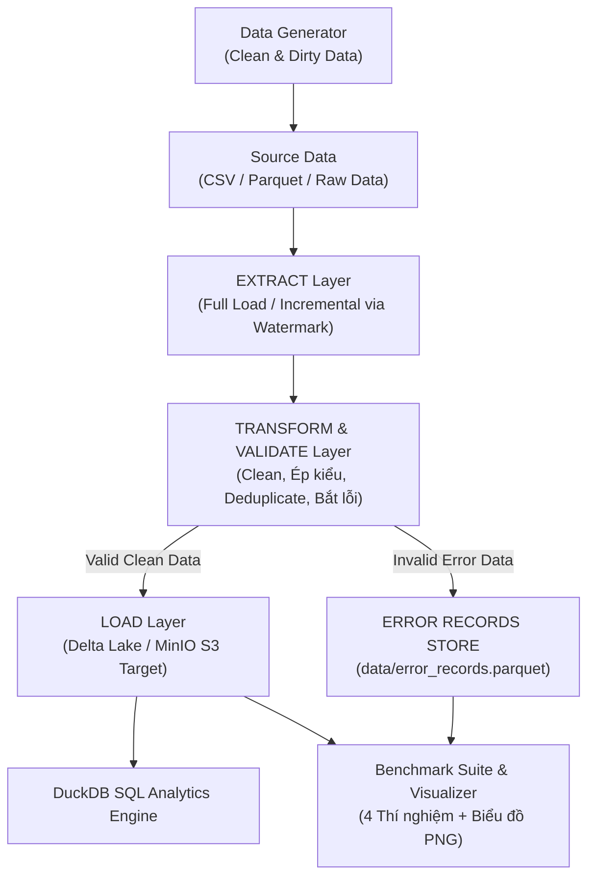

# ĐỒ ÁN: XÂY DỰNG PIPELINE ETL/ELT XỬ LÝ VÀ TÍCH HỢP DỮ LIỆU QUY MÔ LỚN

> Stack công nghệ: **Python + MinIO (S3 Object Storage) + Parquet + Delta Lake + DuckDB** (Không dùng Spark cluster, không dùng Airflow/Kafka cồng kềnh, chạy mượt trên laptop).
> *Lưu ý*: `boto3`, `Pillow` và `Faker` được khai báo trong `requirements.txt` nhưng **không được sử dụng** trong mã nguồn.

---

## 🎯 Kiến trúc Pipeline ETL



---

## 📂 Cấu trúc thư mục dự án

```
big-data/
├── config.py                 # Cấu hình MinIO, đường dẫn local & các hằng số
├── docker-compose.yml        # Khởi chạy MinIO S3 Object Storage
├── main_pipeline.py          # Entrypoint chạy Pipeline ETL (Full / Incremental)
├── query_analytics.py        # Truy vấn DuckDB SQL trên Target Store & Error Records
├── 00_setup_minio.py         # Khởi tạo MinIO Buckets & Ảnh mẫu demo
├── 07_plot_results.py        # Tự động xuất biểu đồ PNG kết quả benchmark
├── requirements.txt          # Danh sách thư viện Python
│
├── generator/                # Module sinh dữ liệu giả lập quy mô lớn
│   ├── __init__.py
│   └── data_generator.py     # Sinh dữ liệu sạch & dữ liệu bẩn (Dirty Data)
│
├── pipeline/                 # Các tầng chính của Pipeline ETL
│   ├── __init__.py
│   ├── extract.py            # Layer Extract (Full Load & Incremental Load Watermark)
│   ├── transform.py          # Layer Transform & Enrich dữ liệu
│   ├── validation.py         # Quy tắc kiểm soát chất lượng dữ liệu (Quality Rules)
│   ├── load.py               # Layer Load ghi vào Delta Lake trên MinIO (có Retry)
│   └── logging_utils.py      # Tracker thống kê thời gian & ghi Log hệ thống
│
├── benchmark/                # Suite đánh giá hiệu năng
│   ├── __init__.py
│   └── run_benchmarks.py     # Thực thi 4 bài thí nghiệm ETL tự động
│
├── data/                     # Thư mục chứa dữ liệu thô, watermark & error records
├── logs/                     # File log quá trình chạy etl_pipeline.log
└── results/                  # File số liệu .csv và biểu đồ đồ họa .png
```

---

## ⚙️ Hướng dẫn cài đặt & Khởi chạy

### 1. Khởi động MinIO (S3 Object Storage)
```powershell
docker compose up -d
```
*Giao diện MinIO Console*: `http://localhost:9001` (Username: `minioadmin` / Password: `minioadmin`).

### 2. Cài đặt thư viện Python
```powershell
python -m venv venv
.\venv\Scripts\activate
pip install -r requirements.txt
```

### 3. Chuẩn bị Object Storage MinIO
```powershell
python 00_setup_minio.py
```

---

## 🚀 Các lệnh thực thi Pipeline ETL

### 1. Chạy Full Load Pipeline
Chạy Full Load với 100.000 bản ghi thô (tỷ lệ dữ liệu có lỗi 5%):
```powershell
python main_pipeline.py --mode full --n 100000 --error-ratio 0.05
```

### 2. Chạy Incremental Load Pipeline
Bổ sung thêm 20.000 bản ghi mới (pipeline tự đọc Watermark từ `data/watermark.json` để chỉ xử lý các bản ghi mới):
```powershell
python main_pipeline.py --mode incremental --n 20000 --error-ratio 0.02
```
> **Lưu ý**: Watermark thực tế tăng từ 100 000 → 120 000, 20 000 bản ghi mới được tạo, trong đó 19 601 bản ghi sạch đã được load, khẳng định đây là incremental thực sự.

### 3. Truy vấn SQL Analytics với DuckDB
Kiểm tra số lượng bản ghi SẠCH tại Target Delta Table và các lý do dữ liệu bị LỖI tại `error_records`:
```powershell
python query_analytics.py
```

---

## 📊 Thí nghiệm Benchmark & Trực quan hóa

Chạy bộ 4 bài thí nghiệm đánh giá chuyên sâu:
```powershell
python benchmark/run_benchmarks.py
```
- **TN1**: Benchmark thời gian xử lý Pipeline theo Quy mô dữ liệu (100K → 5M bản ghi).
- **TN2**: So sánh hiệu năng giữa **Full Load** và **Incremental Load**.
- **TN3**: So sánh xử lý giữa **Dữ liệu 100% Sạch** và **Dữ liệu 10% Lỗi**.
- **TN4**: Ảnh hưởng của kích thước **Batch Size** (1K, 10K, 50K).

### 📈 Giới hạn hệ thống
- Khi chạy benchmark **TN3** với 500 k bản ghi và 10 % dữ liệu lỗi, quá trình sinh dữ liệu gây lỗi **MemoryError** của Pandas (cấp phát bộ nhớ). Điều này cho thấy môi trường hiện tại không đủ RAM để xử lý khối lượng dữ liệu này.

Vẽ biểu đồ đồ họa cho báo cáo/slide:
```powershell
python 07_plot_results.py
```
*Tất cả biểu đồ `.png` và bảng kết quả `.csv` sẽ xuất tự động trong thư mục `results/`.*

---

## 🛡️ Dừng dịch vụ khi hoàn tất
```powershell
docker compose down
```
