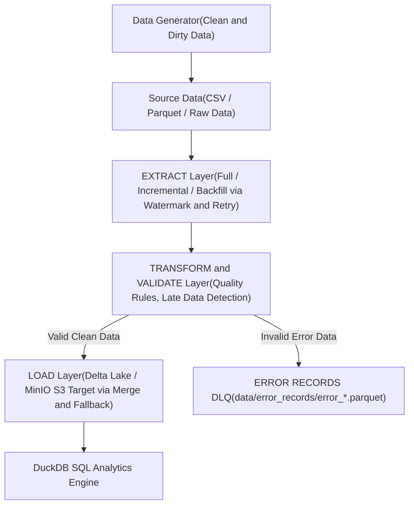

# ĐỒ ÁN: XÂY DỰNG PIPELINE ETL/ELT: EXTRACT–TRANSFORM–LOAD, INCREMENTAL LOADING, RETRY, BACKFILL, XỬ LÝ DỮ LIỆU MUỘN VÀ KIỂM SOÁT LỖI

> Stack công nghệ: **Python + MinIO (S3 Object Storage) + PyArrow + Delta Lake + DuckDB + Pytest**
> Thiết kế mô-đun hóa, không dùng Airflow/Kafka cồng kềnh, chạy mượt trên mọi môi trường.

---

## 🎯 6 Trụ Cột Cốt Lõi Của Đề Tài

1. **Extract–Transform–Load (ETL/ELT):** Kiến trúc phân tầng rõ ràng (Extract -> Transform/Validation -> Load) hỗ trợ cả Batch Loading và Chunk Streaming Processing để tối ưu hóa RAM.
2. **Incremental Loading & Idempotency:** Lọc dữ liệu tăng dần bằng `Watermarking` (ID + Timestamp) kết hợp `Delta Lake MERGE INTO (Upsert)` và `Deduplication` chống trùng lặp dữ liệu khi nạp lại.
3. **Retry Mechanism:** Tự động khôi phục (`@retry_operation` với Exponential Backoff) khi đọc/ghi file hoặc kết nối Storage (MinIO S3) gặp sự cố tạm thời.
4. **Backfill Mechanism:** Nạp lại dữ liệu quá khứ theo dải ngày (`--mode backfill --start-date --end-date`) mà không làm ảnh hưởng hay xáo trộn mốc Watermark hiện tại.
5. **Xử lý Dữ liệu Muộn (Late-Arriving Data):** Tự động phát hiện các bản ghi muộn (`created_at < watermark`), phân loại và thống kê báo cáo (`Records Late`).
6. **Kiểm soát Lỗi & Dead Letter Queue (DLQ):** Phân tách bản ghi sạch và bản ghi lỗi ra thư mục `data/error_records/` dưới dạng các Parquet batch độc lập, loại bỏ hoàn toàn rủi ro tràn RAM (OOM).

---

## 🏗️ Kiến trúc Pipeline ETL



---

## 📂 Cấu trúc thư mục dự án

```
big-data/
├── config.py                 # Cấu hình MinIO, đường dẫn local và các hằng số
├── docker-compose.yml        # Khởi chạy MinIO S3 Object Storage và Services
├── Dockerfile                # Containerize Pipeline Runner
├── main_pipeline.py          # Entrypoint chạy Pipeline ETL (Full / Incremental / Backfill)
├── query_analytics.py        # Truy vấn DuckDB SQL trên Target Store và Error Records
├── 00_setup_minio.py         # Khởi tạo MinIO Buckets và Ảnh mẫu demo
├── 07_plot_results.py        # Tự động xuất biểu đồ PNG kết quả benchmark
├── requirements.txt          # Danh sách thư viện Python
│
├── generator/                # Module sinh dữ liệu giả lập quy mô lớn
│   └── data_generator.py     # Sinh dữ liệu sạch và dữ liệu bẩn (Dirty Data)
│
├── pipeline/                 # Các tầng chính của Pipeline ETL
│   ├── extract.py            # Extract Layer (Full, Incremental và Backfill)
│   ├── transform.py          # Transform Layer (Late Data Detection và DLQ Error Writer)
│   ├── validation.py         # Data Quality Rules (Null, Domain, Datatype, Future date)
│   ├── load.py               # Load Layer (Delta Lake Upsert, Retry và Local Fallback)
│   └── logging_utils.py      # Metrics Summary Tracker và Decorator @retry_operation
│
├── tests/                    # Unit Tests (Pytest)
│   ├── test_extract.py       # Test Extract, Watermark và Backfill logic
│   ├── test_transform.py     # Test Transform và Late Data Detection
│   ├── test_validation.py    # Test Quality Rules
│   └── test_load.py          # Test Load và Idempotency
│
├── data/                     # Thư mục chứa dữ liệu thô, watermark và error records
├── logs/                     # File log quá trình chạy etl_pipeline.log
└── results/                  # File số liệu .csv và biểu đồ đồ họa .png
```

---

## ⚙️ Hướng dẫn cài đặt và Khởi chạy

### 1. Khởi động MinIO (S3 Object Storage)
```powershell
docker compose up -d
```
*Giao diện MinIO Console*: `http://localhost:9001` (Username: `minioadmin` / Password: `minioadmin`).

### 2. Cài đặt thư viện Python
```powershell
python -m venv venv
.\venv\Scripts\activate
pip install -r requirements.txt
```

### 3. Chuẩn bị Object Storage MinIO
```powershell
python 00_setup_minio.py
```

### 4. Chạy Automated Unit Tests (Pytest — 14 PASS)
```powershell
pytest tests/ -v
```

---

## 🚀 Các lệnh thực thi Pipeline ETL

### 1. Chạy Full Load Pipeline
Chạy Full Load với 100.000 bản ghi thô (tỷ lệ dữ liệu có lỗi 5%):
```powershell
python main_pipeline.py --mode full --n 100000 --error-ratio 0.05
```

### 2. Chạy Incremental Load (Watermark và Chunk Processing)
Bổ sung 20.000 bản ghi mới, chia batch 5.000 bản ghi để tối ưu bộ nhớ RAM, tự động Upsert (MERGE INTO) chống lặp dữ liệu:
```powershell
python main_pipeline.py --mode incremental --n 20000 --error-ratio 0.02 --batch-size 5000
```

### 3. Chạy Backfill Load (Nạp bù dữ liệu quá khứ)
Nạp bù 10.000 bản ghi lịch sử từ ngày `2026-01-01` đến `2026-01-31` mà không ghi đè hay làm xáo trộn Watermark hiện tại:
```powershell
python main_pipeline.py --mode backfill --n 10000 --start-date 2026-01-01 --end-date 2026-01-31
```

### 4. Truy vấn SQL Analytics với DuckDB
Kiểm tra số lượng bản ghi SẠCH tại Target Delta Table và các lý do dữ liệu bị LỖI tại `error_records` qua Semantic Views:
```powershell
python query_analytics.py
```

---

## 📊 Thí nghiệm Benchmark và Trực quan hóa

Dự án hỗ trợ 2 bộ thí nghiệm đánh giá hiệu năng chuyên sâu được chuẩn hóa tên gọi rõ ràng:

### 1. Bộ Storage & Format Benchmarks (Đo lường định dạng lưu trữ & Partitioning)
```powershell
python 02_tn1_csv_vs_parquet.py --n 100000
python 03_tn2_partitioning.py --n 100000
python 04_tn3_scale_benchmark.py
```
- **Storage TN1**: So sánh dung lượng & thời gian đọc/ghi giữa **CSV** và **Parquet** (`tn1_csv_vs_parquet.csv`).
- **Storage TN2**: So sánh tốc độ truy vấn DuckDB khi **Không Partition** vs **Có Partition** theo `category` (`tn2_partitioning.csv`).
- **Storage TN3**: Đánh giá hiệu năng lưu trữ và lọc dữ liệu CSV vs Parquet theo **Quy mô tăng dần 100K -> 5M** (`tn3_scale_benchmark.csv`).

### 2. Bộ ETL Pipeline Benchmarks (Đo lường luồng xử lý ETL)
```powershell
python -m benchmark.run_benchmarks
```
- **ETL TN1**: Benchmark tổng thời gian xử lý Pipeline (Extract/Transform/Load) theo **Quy mô dữ liệu** (`etl_tn1_scale.csv`).
- **ETL TN2**: So sánh hiệu năng giữa **Full Load** và **Incremental Load** (`etl_tn2_full_vs_inc.csv`).
- **ETL TN3**: So sánh xử lý và khả năng phát hiện lỗi giữa **Dữ liệu 100% Sạch** và **Dữ liệu 10% Lỗi** (`etl_tn3_clean_vs_dirty.csv`).
- **ETL TN4**: Ảnh hưởng của kích thước **Batch Size** / Chunk Streaming Processing (1K, 10K, 50K) (`etl_tn4_batch_size.csv`).

### 3. Tự động xuất biểu đồ đồ họa cho tất cả các bài thử nghiệm
```powershell
python 07_plot_results.py
```
*Tự động xuất 7 biểu đồ `.png` (ETL TN1-TN4 và Storage TN1-TN3) cùng các bảng `.csv` trong thư mục `results/`.*

---

## 🐳 Khởi chạy bằng Docker Container

Dự án hỗ trợ đóng gói trọn gói bằng Docker:
```powershell
docker compose up --build -d
```

---

## 🛡️ Dừng dịch vụ khi hoàn tất
```powershell
docker compose down
```
