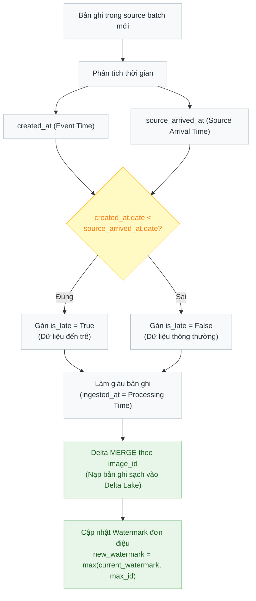

# Pipeline ETL/ELT và Lakehouse Xử lý Dữ liệu Lớn

Dự án triển khai hoàn chỉnh pipeline ETL/ELT theo kiến trúc **Local-first Lakehouse**, phục vụ đề tài học thuật:

> **"Xây dựng pipeline ETL/ELT: Extract–Transform–Load, incremental loading, retry, backfill, xử lý dữ liệu muộn và kiểm soát lỗi"**

Hệ thống được thiết kế chạy thực tế trên môi trường máy đơn, tập trung vào tính đúng đắn của dữ liệu (data correctness), tính bất biến (idempotency), khả năng phục hồi lỗi (fault-tolerance), và tính khả thi trong việc tái lập thực nghiệm (reproducibility).

Mặc dù tên đề tài quy ước bao quát hướng tiếp cận ETL/ELT trong kỹ thuật dữ liệu, kiến trúc thực tế được hiện thực hóa trong mã nguồn là **pipeline ETL (Extract → Transform → Load)** tuần tự, local-first.

---

## 1. Kiến trúc Tổng quan

Toàn bộ pipeline được tổ chức theo 5 nhóm thành phần phối hợp chặt chẽ:


```mermaid
flowchart LR
    %% Subgraphs for 5 groups
    subgraph G1["1. Source & Extraction"]
        direction TB
        GEN["Data Generator"] --> RAW[("Raw CSV / Parquet")]
        RAW --> EXT["Extract Data"]
        EXT --> CHUNK["Chunk Processing\n(chunk_size)"]
    end

    subgraph G2["2. Processing & Data Quality"]
        direction TB
        CHUNK --> TR["Transform & Enrichment\n(size_mb, aspect_ratio)"]
        TR --> VAL{"Validation &\nQuality Rules"}
        VAL -- "Invalid" --> ERR["Error Split"]
        VAL -- "Valid" --> CLEAN["Clean Records\n(+ is_late flag)"]
    end

    subgraph G5["5. State & Reliability"]
        direction TB
        STATE[("State: watermark.json\n- last_image_id\n- processed_sources")]
        RETRY{"Retry Handler\n(Exponential Backoff)"}
    end

    subgraph G3["3. Loading Modes"]
        direction TB
        CLEAN --> LOAD["Load Engine"]
        LOAD --> M_FULL["Full Mode\n(Scan All Sources)"]
        LOAD --> M_INC["Incremental Mode\n(Filter by processed_sources)"]
        LOAD --> M_BF["Backfill Mode\n(image_id < backfill_before_id)"]
    end

    subgraph G4["4. Storage & Analytics"]
        direction TB
        ERR --> DLQ[("Dead Letter Queue\n(data/errors/*.parquet)")]
        UPSERT["Delta MERGE / Upsert\n(image_id + merge_schema)"]
        DELTA[("Local Delta Lake\n(data/lakehouse/clean_metadata)")]
        DUCK["DuckDB Analytics Engine"]
        UPSERT --> DELTA
        DELTA --> DUCK
        DLQ -.-> DUCK
    end

    %% Connections
    STATE -.->|"Read state"| M_INC
    M_INC -.->|"Update watermark & sources"| STATE
    M_FULL -.->|"Reset & update state"| STATE

    M_FULL --> UPSERT
    M_INC --> UPSERT
    M_BF --> UPSERT

    UPSERT -- "Transient error" --> RETRY
    RETRY -- "Retry attempt" --> UPSERT
    RETRY -- "Max attempts exceeded" --> FAIL["Pipeline Abort"]

    %% Styling
    classDef source fill:#E3F2FD,stroke:#1E88E5,stroke-width:1px,color:#0D47A1;
    classDef process fill:#F3E5F5,stroke:#8E24AA,stroke-width:1px,color:#4A148C;
    classDef load fill:#FFF3E0,stroke:#FB8C00,stroke-width:1px,color:#E65100;
    classDef storage fill:#E8F5E9,stroke:#43A047,stroke-width:1px,color:#1B5E20;
    classDef state fill:#ECEFF1,stroke:#607D8B,stroke-width:1px,color:#263238;

    class GEN,RAW,EXT,CHUNK source;
    class TR,VAL,ERR,CLEAN process;
    class LOAD,M_FULL,M_INC,M_BF load;
    class DLQ,UPSERT,DELTA,DUCK storage;
    class STATE,RETRY,FAIL state;
```

### Thành phần Kiến trúc
- **Source & Extraction:** Dữ liệu nguồn dạng CSV hoặc Parquet được đọc tuần tự theo các khối (`chunk_size`) nhằm tối ưu bộ nhớ.
- **Processing & Data Quality:** Dữ liệu được tính toán thuộc tính bổ sung, áp dụng 7 quy tắc kiểm tra chất lượng (Data Quality Rules) và phân tách rạch ròi thành bản ghi sạch (Clean) hoặc bản ghi lỗi (DLQ).
- **Loading Modes:** Điều phối 3 chế độ nạp (Full, Incremental, Backfill) phù hợp với từng ngữ cảnh vận hành.
- **Storage & Analytics:** Bảng đích Delta Lake cục bộ đảm bảo chuẩn giao dịch ACID và phân vùng theo `category`; DuckDB phục vụ truy vấn OLAP trực tiếp trên Delta table và DLQ Parquet.
- **State & Reliability:** Tệp `data/watermark.json` lưu trữ con trỏ `last_image_id` cùng danh sách `processed_sources`; cơ chế Retry tự động xử lý các lỗi I/O và lock tạm thời.

---

## 2. Công nghệ Sử dụng

Dự án sử dụng bộ công cụ hiện đại, tối ưu cho môi trường local-first:

| Công nghệ | Vai trò trong hệ thống |
|---|---|
| **Python** (3.10+) | Ngôn ngữ phát triển toàn bộ pipeline và logic điều phối |
| **Pandas & NumPy** | Xử lý khung dữ liệu, vector hóa và kiểm tra điều kiện validation |
| **PyArrow** | Đọc ghi định dạng Parquet theo lô (batch/chunk) hiệu năng cao |
| **Delta Lake (`deltalake`)** | Định dạng bảng Lakehouse, kiểm soát giao dịch ACID, schema evolution và MERGE |
| **DuckDB** | Động cơ OLAP nhúng truy vấn SQL trực tiếp trên Delta Lake và DLQ |
| **Pytest** | Bộ kiểm thử tự động toàn diện kiểm chứng mọi chức năng nghiệp vụ |
| **Matplotlib** | Trực quan hóa kết quả đo lường và benchmark |

> **Phạm vi kiến trúc:** Hệ thống không yêu cầu hạ tầng phân tán phức tạp (Spark, Kafka, Airflow, Kubernetes, MinIO). Pipeline vận hành theo mô hình batch local-first nhưng áp dụng các khái niệm watermark và xử lý dữ liệu muộn (late-arriving) cùng lưu trữ Lakehouse cục bộ, bảo đảm tính độc lập, khả năng tái lập thực nghiệm và chạy ổn định trên một máy tính cá nhân.

---

## 3. Các Chức năng Cốt lõi

### 3.1. Pipeline ETL theo Chunk
- **Extract:** Trích xuất dữ liệu từ CSV/Parquet theo từng chunk có kích thước linh hoạt (`chunk_size`), tránh cạn kiệt RAM khi xử lý tập dữ liệu lớn.
- **Transform:** Làm giàu dữ liệu thông qua tính dung lượng (`size_mb`), tỉ lệ khung hình (`aspect_ratio`), gán nhãn thời gian nạp (`ingested_at`) và cờ đánh dấu dữ liệu muộn (`is_late`).
- **Load:** Nạp dữ liệu vào Delta Lake thông qua cơ chế idempotent upsert.

### 3.2. Incremental Loading (Nạp Tăng dần)
- Hệ thống quản lý con trỏ tăng dần qua `last_image_id` và định danh từng lô dữ liệu thông qua `processed_sources`.
- Khi chạy chế độ `incremental`, pipeline chỉ nạp các file nguồn mới xuất hiện chưa có tên trong `processed_sources`.
- Không loại bỏ cứng dữ liệu dựa trên ID ở bước Extract, cho phép tiếp nhận cả dữ liệu bình thường và dữ liệu đến trễ nằm trong batch mới.
- High-watermark được cập nhật tăng đơn điệu: `new_watermark = max(current_watermark, max_id_processed)`.

### 3.3. Xử lý Dữ liệu Muộn (Late-arriving Data)
Hệ thống phân định rạch ròi 4 trường dữ liệu và ngữ nghĩa thời gian:
1. `image_id`: Định danh bản ghi và con trỏ gia số (incremental cursor).
2. `created_at`: Event Time (thời điểm sự kiện thực tế diễn ra).
3. `source_arrived_at`: Source Arrival Time (thời điểm hệ thống nguồn tiếp nhận dữ liệu và đóng gói vào batch).
4. `ingested_at`: Pipeline Processing Time (thời điểm pipeline thực hiện nạp dữ liệu).

Business rule của prototype:
`is_late = created_at.date < source_arrived_at.date`


```mermaid
flowchart TD
    REC["Bản ghi trong source batch mới"] --> PARSE["Phân tích thời gian"]
    PARSE --> T1["created_at (Event Time)"]
    PARSE --> T2["source_arrived_at (Source Arrival Time)"]

    T1 & T2 --> COMP{"created_at.date <\nsource_arrived_at.date?"}

    COMP -- "Đúng" --> LATE["Gán is_late = True\n(Dữ liệu đến trễ)"]
    COMP -- "Sai" --> NORM["Gán is_late = False\n(Dữ liệu thông thường)"]

    LATE & NORM --> INGEST["Làm giàu bản ghi\n(ingested_at = Processing Time)"]
    INGEST --> MERGE["Delta MERGE theo image_id\n(Nạp bản ghi sạch vào Delta Lake)"]

    MERGE --> WM["Cập nhật Watermark đơn điệu\nnew_watermark = max(current_watermark, max_id)"]

    classDef default fill:#F8F9FA,stroke:#B0BEC5,stroke-width:1px,color:#263238;
    classDef highlight fill:#FFF9C4,stroke:#FBC02D,stroke-width:1px,color:#F57F17;
    classDef success fill:#E8F5E9,stroke:#43A047,stroke-width:1px,color:#1B5E20;
    class COMP highlight;
    class MERGE,WM success;
```

- Dữ liệu đến muộn không bị định nghĩa máy móc theo điều kiện `image_id <= watermark`.
- Bản ghi đến trễ trong batch mới vẫn được đưa vào pipeline, được đánh dấu `is_late = True`, được nạp an toàn vào Delta Lake thông qua `MERGE` và không làm lùi watermark.
- Cả bản ghi hợp lệ lẫn bản ghi lỗi (DLQ) đều giữ lại cờ `is_late` để phục vụ audit.

### 3.4. Cơ chế Thử lại (Transient Error Retry)
- Áp dụng Retry Pattern với Exponential Backoff tại tầng nạp Delta Lake (`pipeline/load.py`).
- Chỉ thử lại có chọn lọc đối với các lỗi tạm thời (transient errors) về I/O, file lock hoặc protocol: `IOError`, `OSError`, `CommitFailedError`, `DeltaProtocolError`.
- Các lỗi logic hoặc sai cấu trúc dữ liệu (`ValueError`, `TypeError`) sẽ dừng ngay lập tức mà không retry vô ích.
- Tham số mặc định: `DEFAULT_MAX_ATTEMPTS = 3`, `DEFAULT_RETRY_DELAY = 0.5s`, `DEFAULT_BACKOFF_FACTOR = 2.0`. Số lần retry được ghi nhận minh bạch trong `retry_count`.

### 3.5. Nạp lại Lịch sử (Backfill)
- Cho phép chủ động quét và nạp lại một khoảng dữ liệu lịch sử thông qua cờ `--backfill-before-id`.
- **Tính cách ly hoàn toàn:** Quá trình Backfill không cập nhật `last_image_id` và không ghi nhận vào `processed_sources`, bảo toàn nguyên vẹn chu trình Incremental.
- Kết hợp với Delta MERGE giúp việc chạy Backfill nhiều lần không gây trùng lặp dữ liệu đích.

### 3.6. Kiểm soát Lỗi & DLQ Idempotency
Hệ thống áp dụng 7 luật kiểm tra dữ liệu đầu vào:
1. `image_id` không được rỗng (Null).
2. `file_size` phải lớn hơn 0.
3. Kích thước `width` và `height` phải lớn hơn 0.
4. `category` phải thuộc danh mục hợp lệ: `san_pham`, `chan_dung`, `phong_canh`, `do_an`, `dong_vat`, `kien_truc`.
5. `format` phải thuộc định dạng cho phép: `jpg`, `png`, `webp`.
6. `created_at` phải đúng định dạng thời gian và không thuộc tương lai.
7. `image_id` không được trùng lặp trong cùng phiên xử lý.

Các bản ghi không hợp lệ được chuyển sang Dead Letter Queue (`data/errors/`). Mỗi bản ghi lỗi được gán một `error_id` băm SHA256 dựa trên nội dung và `error_batch_id` đại diện cho lô lỗi. Khi chạy lại (rerun), file DLQ được ghi đè xác định, giúp ngăn việc tạo bản ghi lỗi trùng lặp khi rerun cùng source batch.

### 3.7. Bảng so sánh 3 Chế độ Nạp

| Tiêu chí | Full Load (`full`) | Incremental Load (`incremental`) | Backfill (`backfill`) |
|---|---|---|---|
| **Phạm vi nguồn** | Toàn bộ file nguồn trong thư mục | Chỉ file chưa có trong `processed_sources` | Đọc theo điều kiện ID lịch sử |
| **Xử lý Target** | Khởi tạo / Ghi đè cấu trúc bảng | MERGE / Upsert theo `image_id` | MERGE / Upsert theo `image_id` |
| **Cập nhật Watermark** | Cập nhật lên max ID | Cập nhật tiến lên: `max(cũ, mới)` | **Không thay đổi** |
| **Cập nhật Sources** | Làm mới danh sách file đã nạp | Bổ sung file mới vào tập hợp | **Không thay đổi** |
| **Xử lý Late Data** | Nhận diện qua Event vs Arrival | Nhận diện qua Event vs Arrival | Nhận diện theo phạm vi lịch sử |

---

## 4. Cấu trúc Dự án

```text
big-data/
├── config.py                   # Cấu hình đường dẫn, danh mục metadata và tham số retry
├── main_pipeline.py            # Entry point điều phối pipeline (Full, Incremental, Backfill)
├── query_analytics.py          # Script phân tích OLAP qua DuckDB
├── 01_generate_metadata.py     # Script tạo tập dữ liệu mẫu độc lập
├── requirements.txt            # Danh sách thư viện phụ thuộc
├── generator/
│   ├── __init__.py
│   └── data_generator.py       # Bộ sinh dữ liệu thử nghiệm có kiểm soát lỗi và arrival time
├── pipeline/
│   ├── __init__.py
│   ├── extract.py              # Đọc file chunk, quản lý file watermark và state
│   ├── transform.py            # Biến đổi dữ liệu, kiểm tra late-arriving và ghi nhận DLQ
│   ├── validation.py           # Bộ luật kiểm soát chất lượng dữ liệu (Data Quality)
│   ├── load.py                 # Nạp dữ liệu vào Delta Lake, retry và merge schema
│   └── logging_utils.py        # Quản lý logging và thống kê PipelineMetrics
├── tests/
│   ├── test_analytics.py       # Kiểm thử truy vấn DuckDB
│   ├── test_backfill.py        # Kiểm thử tính năng Backfill và DLQ idempotency
│   ├── test_generator_validation.py # Kiểm thử bộ sinh dữ liệu và validation rules
│   ├── test_late_arriving.py   # Kiểm thử toàn diện dữ liệu trễ và tính đơn điệu của watermark
│   ├── test_pipeline.py        # Kiểm thử luồng tích hợp và chunk reader
│   ├── test_retry.py           # Kiểm thử cơ chế retry lỗi transient và backoff
│   └── test_smoke.py           # Kiểm thử kiểm tra cấu trúc cơ bản
└── data/                       # Thư mục dữ liệu runtime (raw, errors, lakehouse, watermark.json)
```

---

## 5. Hướng dẫn Cài đặt & Thiết lập

### Yêu cầu Môi trường
- Python 3.10 trở lên.
- Hệ điều hành: Windows, macOS hoặc Linux.

### Các bước Cài đặt

1. **Khởi tạo môi trường ảo:**
   ```powershell
   python -m venv .venv
   .\.venv\Scripts\activate
   ```
   *(Trên Linux/macOS: `source .venv/bin/activate`)*

2. **Cài đặt thư viện:**
   ```powershell
   pip install -r requirements.txt
   ```

---

## 6. Hướng dẫn Thực thi & Quick Start

Mọi câu lệnh dưới đây đều đã được kiểm chứng hoạt động thực tế trên repository.

### 6.1. Chạy Full Load
Khởi tạo bảng Delta Lake và tải toàn bộ dữ liệu ban đầu:
```powershell
python main_pipeline.py --mode full --rows 1000 --error-ratio 0.05 --chunk-size 500
```

### 6.2. Chạy Incremental Load
Mô phỏng đợt dữ liệu tiếp theo với watermark tự động tịnh tiến:
```powershell
python main_pipeline.py --mode incremental --rows 200 --error-ratio 0.02 --chunk-size 100
```

### 6.3. Chạy Backfill
Nạp lại vùng dữ liệu lịch sử mà không làm ảnh hưởng tới watermark:
```powershell
python main_pipeline.py --mode backfill --rows 100 --backfill-before-id 50 --chunk-size 50
```

### 6.4. Truy vấn Phân tích qua DuckDB
Thực hiện truy vấn SQL trên tập dữ liệu sạch trong Delta Lake và bảng lưu lỗi DLQ:
```powershell
python query_analytics.py
```

*Kết quả mẫu hiển thị (minh họa cấu trúc đầu ra, các con số phụ thuộc vào quy mô dữ liệu và runtime thực tế):*
```text
total_clean_records: 1140
by_category: [('chan_dung', 195), ('do_an', 198), ('dong_vat', 188), ('kien_truc', 179), ('phong_canh', 192), ('san_pham', 188)]
by_format: [('jpg', 380), ('png', 375), ('webp', 385)]
by_month: [(2023, 1, 32), (2023, 2, 28), ...]
error_records: 60
```

---

## 7. Minh chứng Xử lý Dữ liệu Muộn (Late-arriving Scenario)

Hệ thống đã chứng minh khả năng xử lý dữ liệu trễ qua kịch bản thực tế:

1. **Lô 1 (`batch_1.parquet`):**
   - Chứa IDs: 100, 101, 102
   - `created_at` = 2026-09-20, `source_arrived_at` = 2026-09-20
   - Thực thi pipeline: Nạp 3 bản ghi, Watermark ghi nhận = **102**.
   - Trạng thái `processed_sources` = `['batch_1.parquet']`.

2. **Lô 2 (`batch_2.parquet`):**
   - ID 105 (Bình thường): `created_at` = 2026-09-23, `source_arrived_at` = 2026-09-23 -> `is_late = False`.
   - ID 95 (Dữ liệu muộn): `created_at` = 2026-09-20, `source_arrived_at` = 2026-09-23 -> `is_late = True`.
   - Thực thi Incremental:
     - Pipeline phát hiện `batch_2.parquet` là nguồn mới, nạp toàn bộ mà không drop ID 95.
     - Cả 105 và 95 đều được ghi thành công vào Delta Lake.
     - Watermark tăng lên: `max(102, 105) = 105` (không bị lùi về 95).
     - Trạng thái `processed_sources` = `['batch_1.parquet', 'batch_2.parquet']`.

3. **Chạy lại Lô 2 (Rerun Idempotency):**
   - Pipeline phát hiện file đã nằm trong `processed_sources` -> Tự động kết thúc sớm (extracted = 0, loaded = 0).
   - Bảng Delta giữ nguyên chính xác 5 bản ghi sạch, watermark giữ nguyên ở 105, không phát sinh duplicate.

---

## 8. Kết quả Kiểm thử Tự động (Automated Testing)

Toàn bộ các yêu cầu kỹ thuật được bảo vệ bằng hệ thống unit và integration tests tự động.

Chạy kiểm thử với cờ vô hiệu hóa cache bytecode:
```powershell
python -B -m pytest -q
```

**Kết quả kiểm thử thực tế:**
```text
26 passed, 2 warnings
```
*(Ghi chú: 2 warnings liên quan đến việc dateutil phân tích chuỗi ngày cố ý làm sai lệch trong test case kiểm thử lỗi).*

### Phân bổ 26 Test Cases:
- `tests/test_late_arriving.py` (6 tests): Kiểm chứng dữ liệu muộn khác ngày, cùng ngày, cùng ngày khác giờ, batch hỗn hợp, tính đơn điệu của watermark, và DLQ cho bản ghi muộn bị lỗi.
- `tests/test_retry.py` (4 tests): Kiểm chứng kịch bản transient failure rồi thành công, kịch bản quá số lần thử tối đa, từ chối retry lỗi phi tạm thời, và tính bất biến khi retry MERGE.
- `tests/test_backfill.py` (6 tests): Kiểm chứng bộ lọc ID, nạp Delta, tính bất biến của watermark khi backfill, và khử trùng lặp DLQ.
- `tests/test_pipeline.py` (4 tests): Kiểm chứng chunk reader, cơ chế cập nhật watermark Full -> Incremental, và Delta upsert.
- `tests/test_generator_validation.py` (4 tests): Kiểm chứng tính lặp lại của generator, phân tách dữ liệu lỗi, và loại trừ duplicate.
- `tests/test_analytics.py` (1 test): Kiểm chứng độ chính xác khi DuckDB đếm bản ghi sạch và lỗi.
- `tests/test_smoke.py` (1 test): Kiểm chứng các trường metadata cơ bản.
